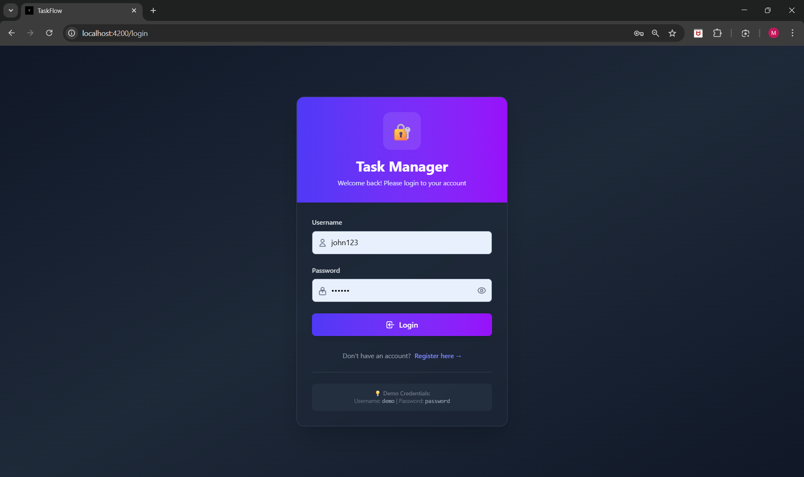
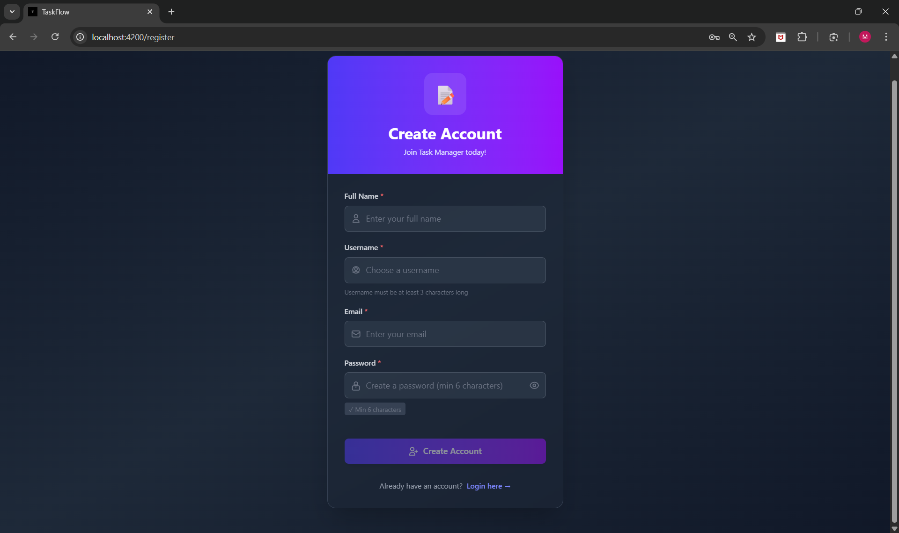
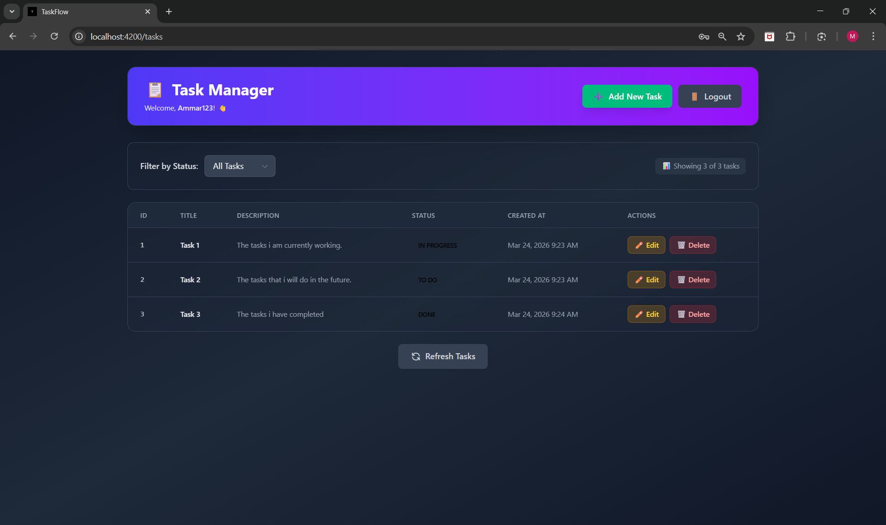
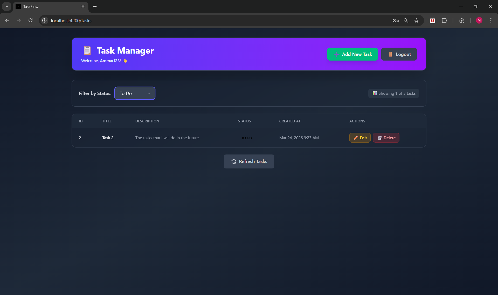
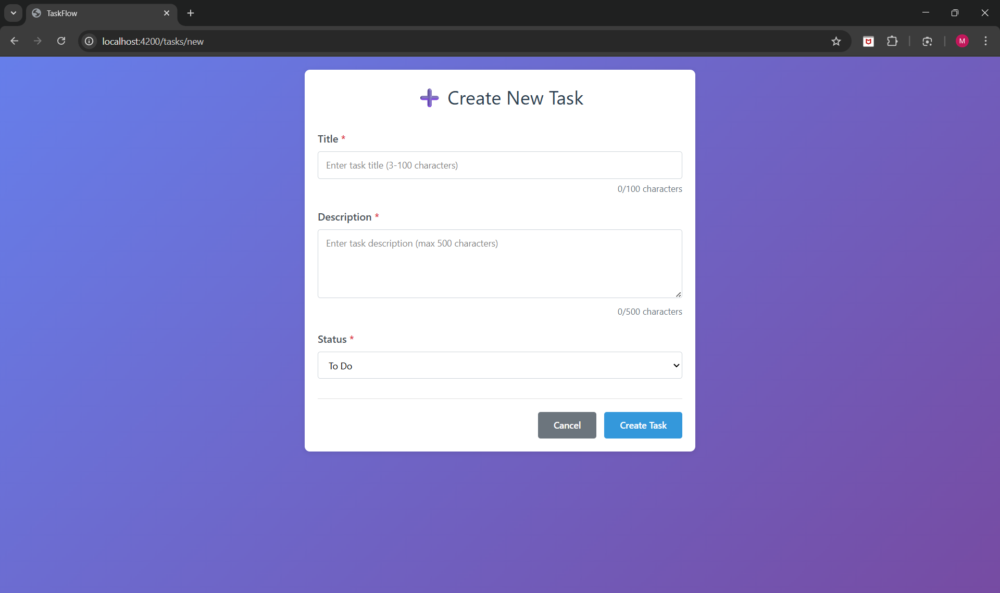
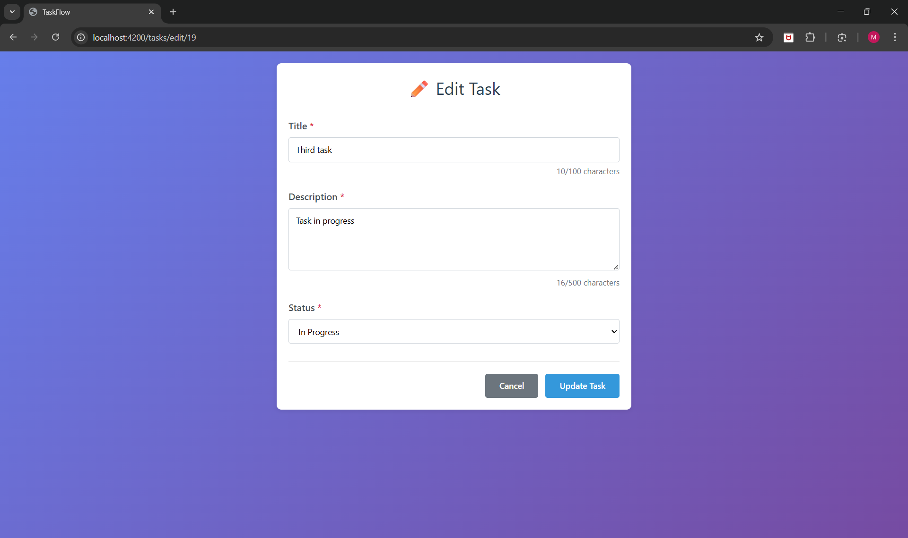

# Task Manager App

Full-stack Task Manager application with Angular, Spring Boot, MySQL, JWT authentication, and Docker support.

## Tech Stack
- **Frontend:** Angular with Tailwind CSS
- **Backend:** Spring Boot (Java 21) with Maven
- **Database:** MySQL 8.0+
- **Authentication:** JWT
- **Containerization:** Docker & Docker Compose


## Prerequisites
- Node.js v20.14.0+
- Java 21
- Maven
- MySQL 8.0+
- Docker & Docker Compose

---

## Database Setup

### 1. Install MySQL
Download from: https://dev.mysql.com/downloads/

### 2. Create Database
```sql
CREATE DATABASE taskflowdb;
```

### 3. Update Database Credentials
Edit `backend/src/main/resources/application.yaml`:

```yaml
spring:
  datasource:
    url: jdbc:mysql://localhost:3306/taskflowdb
    username: root
    password: YOUR_MYSQL_PASSWORD
```

---

## How to Run Backend

### 1. Navigate to backend folder
```bash
cd backend
```

### 2. Run the application
```bash
./mvnw spring-boot:run
```

Backend runs on: **http://localhost:8080**

---

## How to Run Frontend

### 1. Navigate to frontend folder
```bash
cd frontend
```

### 2. Install dependencies (first time only)
```bash
npm install
```

### 2. Build Angular app for production
```bash
ng build -c production
```

### 4. Run the application
```bash
ng serve
```

Frontend runs on: **http://localhost:4200**

---

## Access the Application

Open your browser: **http://localhost:4200**

---


## Running with Docker

### 1. Build and start containers
```bash
docker-compose up --build
```

### 2. Stopping containers
```bash
docker-compose down
```

---

## API Endpoints

| Method | Endpoint | Description |
|--------|----------|-------------|
| GET | `/api/tasks` | Get all tasks |
| GET | `/api/tasks/{id}` | Get task by ID |
| POST | `/api/tasks` | Create new task |
| PUT | `/api/tasks/{id}` | Update task |
| DELETE | `/api/tasks/{id}` | Delete task |
| POST | `/api/auth/login` | User login (JWT) |
| POST | `/api/auth/register` | Register new user |

---

## Screenshots

### Login


### Register


### Task List



### Add Task


### Edit Task


---

## Troubleshooting

**Backend won't start:**
- Check if MySQL is running
- Verify database `taskflowdb` exists
- Check password in `application.yaml`

**Frontend won't start:**
- Run `npm install` first
- Check if port 4200 is available

**Frontend not loading routes:**
- Ensure Angular build ran successfully (ng build -c production)
- Use Docker SPA fix (serve -s dist/frontend) if using container

**Cannot connect to backend:**
- Make sure backend is running on port 8080
- Check console for errors
- Check Docker network or CORS configuration

---

## Author
M H Ammar